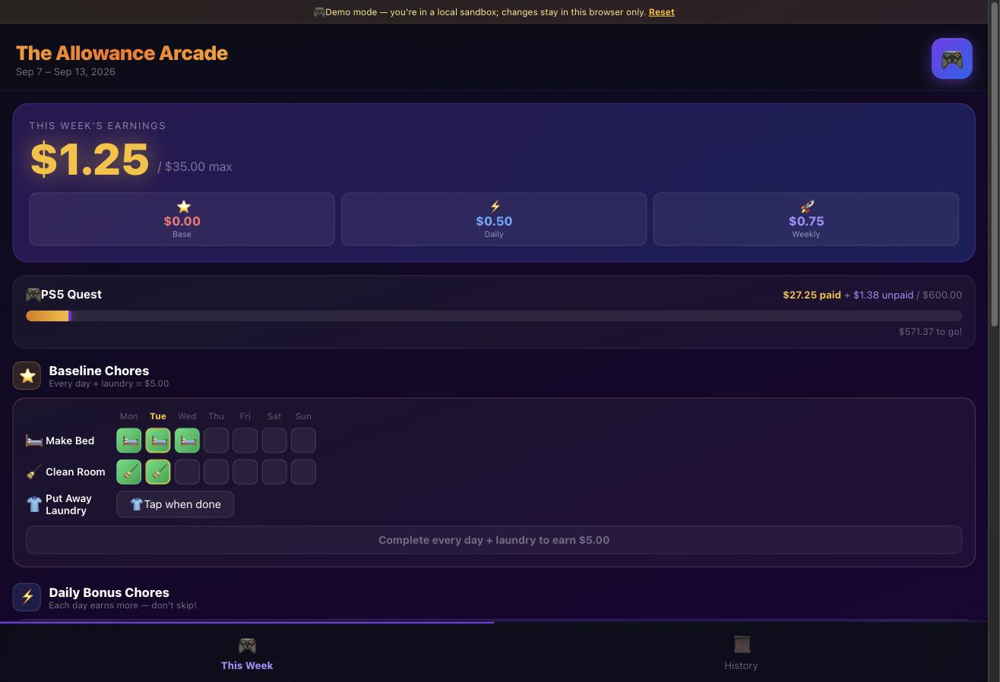
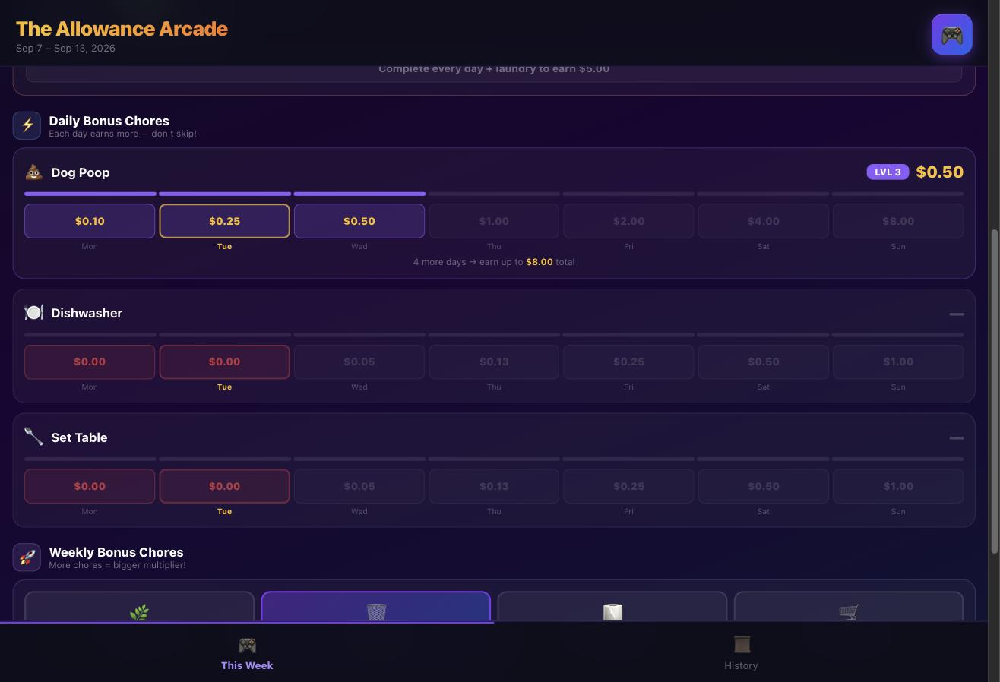
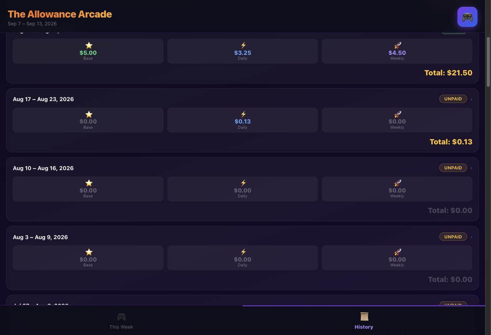

# 🎮 The Allowance Arcade

A gamified chore-and-allowance tracker for kids. Boring chores pay a flat rate;
bonus chores pay an **escalating streak ladder** and a **weekly multiplier**; every
dollar earned fills a progress bar toward one big savings goal. Built for — and
used daily by — a real family, syncing live across everyone's phones.

> **Try it:** the public demo runs entirely in your browser on sample data —
> tap chores, watch earnings climb, hit payday. Nothing is saved to any server.
> _(Live demo link: **TODO — add your deploy URL**)_

<p align="center">
  
  
  
</p>

## The game design (why it's an *arcade*, not a checklist)

The whole point is that the incentives are shaped, not flat:

- **Baseline chores** (make bed, clean room, laundry) pay a flat **$5 — but only if
  you do them every day.** All-or-nothing, so the floor stays boring and reliable.
- **Daily bonus chores** pay an **escalating ladder**: the 1st day you do it is worth
  a little, the 2nd more, … the 7th a lot ($0.10 → $0.25 → … → $8.00). Streaks
  compound, so skipping a day is expensive. "Don't skip!"
- **Weekly bonus chores** apply a **multiplier**: the more of them you complete, the
  more *each one* is worth. Doing four is worth far more than four times doing one.
- Everything rolls up into a single **goal bar** — a visible, always-present target
  (a PS5, a bike, a trip) that turns a week of chores into visible progress.

Kids optimize. That's the feature.

## How it's built

- **React 19 + Vite**, deployed on **Vercel**.
- **Supabase** (Postgres + Realtime) for storage and **live multi-device sync** —
  check a chore on one phone, it updates on another in real time.
- **Optimistic UI**: taps apply instantly and sync in the background.
- **Demo mode**: with no backend configured, the app runs against a local, seeded,
  in-browser data store — so the public deployment is a safe sandbox that can't
  reach anyone's real data.

## Run it yourself

### Option A — Demo mode (no backend, 30 seconds)

```bash
git clone https://github.com/phenly/allowance-arcade
cd allowance-arcade
npm install
npm run dev        # opens on local sample data — no database needed
```

With no Supabase credentials present, the app automatically runs in demo mode.

### Option B — Your own live backend (for real family use)

1. Create a free [Supabase](https://supabase.com) project.
2. In the Supabase **SQL Editor**, run `supabase/migrations/001_initial.sql`, then
   `supabase/migrations/002_add_total_override.sql`.
3. Copy the env template and fill in your project's URL + anon key:
   ```bash
   cp .env.example .env.local
   # edit .env.local → VITE_SUPABASE_URL, VITE_SUPABASE_ANON_KEY
   ```
4. `npm run dev` (or deploy to Vercel with those two env vars set).

## Make it yours

Everything you'd want to change lives in one file: **`src/lib/utils.js`**.

- `BASELINE_CHORES` — the flat-rate must-dos
- `DAILY_BONUS` — bonus chores + their per-day `rates` ladder
- `WEEKLY_BONUS` — weekly chores + their base `value` (the multiplier is automatic)
- `LEVEL_LABELS` / `LEVEL_COLORS` — the streak-level styling
- `GOAL` — the savings target: `{ label, emoji, amount }`. Point it at anything.

Change those and the arcade retargets to your kid, your chores, your goal.

> One caveat: the three **baseline** chore ids (`bed`/`room`/`laundry`) are also
> referenced by name in `computeEarnings()` and `useWeekData`'s `EMPTY_*` maps, so
> renaming a *baseline* id means updating those two spots too. The daily and weekly
> bonus chores are fully data-driven and safe to add/remove/rename freely.

## Warts & non-goals (the honest part)

This was vibe-coded for one family's fridge, not hardened for the world. Known
trade-offs, chosen on purpose:

- **No auth. Public-access row-level security.** The Supabase policies grant open
  read/write. That's fine for a *private* instance whose anon key you don't share —
  and it's exactly why the public demo runs with **no backend at all** rather than
  exposing a real one. Don't point a public deployment at a live database with these
  policies.
- **Single family per backend.** There are no accounts or per-user isolation. One
  deployment = one family. (Multi-tenancy was deliberately out of scope.)
- **The chore *shape* is fixed** at 3 baseline / 3 daily / 4 weekly. Labels, icons,
  rates, and the goal are config; changing the *number* or the earning *mechanics*
  means editing `computeEarnings()`.
- **Supabase free tier pauses** when idle; the first load after a nap retries for a
  few seconds while the database wakes.
- **The "edit total" code is a UI speed-bump, not security** — it just stops a kid
  from casually inflating a week.
- **Styles are inline and there are no automated tests.** It's a small app that has
  earned its keep on real phones; that was the bar, not test coverage.

## License

Not yet licensed — treat as source-available for reading and learning. (An OSI
license may be added later.)
